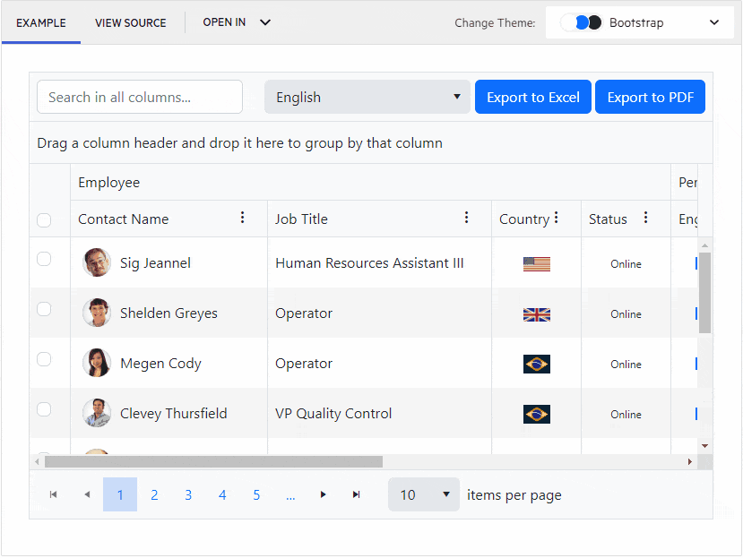

# Ocean Blue A11y Accessibility Swatch

The [Web Content Accessibility Guidelines](https://www.w3.org/TR/WCAG21/) sections [1.4.3 Contrast (Minimum)](https://www.w3.org/TR/WCAG21/#contrast-minimum) and [1.4.6 Contrast (Enhanced)](https://www.w3.org/TR/WCAG21/#contrast-enhanced) define the required contrast ratio for compliance. The WCAG Level AA requires a contrast ratio of at least 4.5:1 for normal text and 3:1 for large text. WCAG Level AAA requires a contrast ratio of at least 7:1 for normal text and 4.5:1 for large text. The Kendo UI for Vue library conforms to WCAG Level AA with the Default Ocean Blue A11y theme swatch coming with enabled contrast focus indicators (available as of version **6.0.1** of the [Default Theme](https://www.telerik.com/kendo-vue-ui/components/styling/theme-default/)).

You can test the accessibility swatch in all Kendo UI for Vue demos by choosing it in the `Change Theme` menu:



Kendo UI for Vue distributes the Default Ocean Blue A11y theme swatch with the `@progress/kendo-theme-default` package. If you don't need to apply any [customization](https://www.telerik.com/kendo-vue-ui/components/styling/customizing/) to the theme, you can can reference the precompiled CSS directly from unpkg CDN:

````html
https://cdn.kendostatic.com/themes/6.0.1/default/default-ocean-blue-a11y.css
````

If you prefer, or you need to customize the provided accessibility swatch, you can install the Default theme and import the swatch styles directly:

````jsx
// Import the Default theme accessibility swatch
import '@progress/kendo-theme-default/dist/default-ocean-blue-a11y.scss';
````

## Known Limitations

`BottomNavigation` and `ColorPalette` fail the *WCAG success criteria 1.4.11 Non-text contrast for the focus indicator* on its items.

## Suggested Links

* [Overview of Accessibility]()
* [ThemeBuilder Pro App](https://themebuilderapp.telerik.com/)
* [kendo-themes Repository](https://github.com/telerik/kendo-themes)
* [Kendo Themes Swatches Wiki](https://github.com/telerik/kendo-themes/wiki/Swatches)

