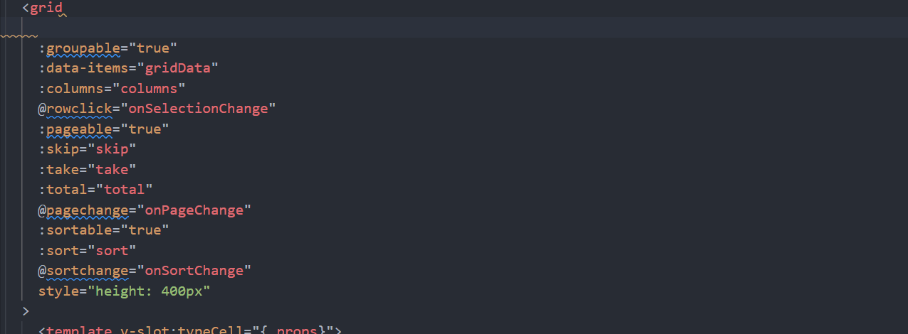

# Kendo UI for Vue TypeScript Integration Overview

## Vue and Typescript

With the release of Vue 3, TypeScript is getting more and more popular among Vue users. The main reason for this change is because now it is much easier to configure your project to use TypeScript and benefit from the functionality the language provides. 

> Historically, the Kendo UI for Vue Native components are TypeScript compatible in both the Vue 3 and Vue 2 scenarios, however Vue 2 is currently in its end-of-support phase till Nov 2024. After our last major release for 2024, Vue 2 will no longer be supported in the new versions of the Kendo UI for Vue components. For more details about the Vue 2 support, please check our [Vue 2 End of Support article](slug:vue2-end-of-support).

## Kendo UI for Vue and TypeScript

The Kendo UI for Vue Native components are fully compatible with TypeScript. Using the [Volar Visual Studio Code extension](https://marketplace.visualstudio.com/items?itemName=johnsoncodehk.volar) you can benefit from the intellisense definitions available for all Kendo UI for Vue Native components. 

> Volar is an extension recommended by the Vue core team and widely communicated by them

If you have previous experience with the `Vetur IDE`, to use the discussed above intellisense functionality, we recommend switching to `Vоlar`.

## Getting started with Kendo UI for Vue and TypeScript

Based your preferences in using the Vue's Composition or Options API, here are to articles that provide step-by-step instructions on how the Kendo UI for Vue Native components can be used with TypeScript:

* [Kendo UI for Vue - First Steps with TypeScript + Composition API]()
* [Kendo UI for Vue - First Steps with TypeScript + Options API]()

## Composition API Details

As mentioned above, the Kendo UI for Vue Native components can be used both with **[Options API](https://vuejs.org/guide/introduction.html#options-api)** and **[Composition API](https://vuejs.org/guide/introduction.html#composition-api)**. 

> The Composition API is available out of the box in Vue 3. To use it in Vue 2, you will have to install the [@vue/composition-api](https://www.npmjs.com/package/@vue/composition-api) package. More about the usage of the **@vue/composition-api** package, you can find on [its GitHub repository](https://github.com/vuejs/composition-api).  

## Suggested Links

