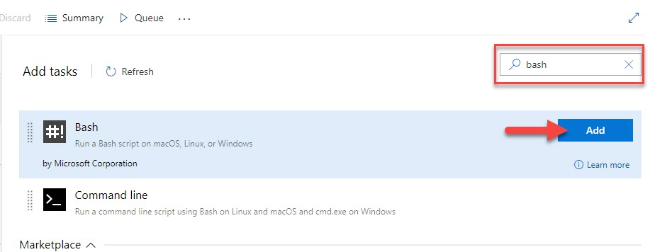

# Add the License Key to CI services

This section describes how to set up and activate your Kendo UI for Vue [license key](slug:my_license#toc-download-your-license-key) across a few popular CI services by using environment variables or secrets.

The license key must be present at build time. The recommended approach is to use an environment variable.

Each platform has a different process for setting environment variables. Some popular examples are listed below.

## GitHub Actions

1. Create a new [Repository Secret](https://docs.github.com/en/actions/reference/encrypted-secrets#creating-encrypted-secrets-for-a-repository) or an [Organization Secret](https://docs.github.com/en/actions/reference/encrypted-secrets#creating-encrypted-secrets-for-an-organization). Set the name of the secret to `TELERIK_LICENSE` and paste the contents of the license file as value.
1. Add a build step to activate the license _after_ running `npm install` or `yarn`:

```yaml
steps:
    # ... install modules before activating the license
    - name: Install NPM modules
      run: npm install

    - name: Activate Kendo UI License
      run: npx kendo-ui-license activate
      # Set working directory if the application is not in the repository root folder:
      # working-directory: 'ClientApp'
      env:
        TELERIK_LICENSE: ${{ secrets.TELERIK_LICENSE }}

    # ... run application build after license activation
    - name: Build Application
      run: npm run build
```

## Azure Pipelines (YAML)

1. Create a new [User-defined Variable](https://docs.microsoft.com/en-us/azure/devops/pipelines/process/variables?view=azure-devops&tabs=yaml%2Cbatch) named `TELERIK_LICENSE`. Paste the contents of the license key file as value.
1. Add a build step to activate the license _after_ running `npm install` or `yarn`:

Syntax for Windows build agents:

```yaml
pool:
  vmImage: 'windows-latest'

steps:

# ... install modules before activating the license
- script: call npm install
  displayName: 'Install NPM modules'

- script: call npx kendo-ui-license activate
  displayName: 'Activate Kendo UI License'
  # Set working directory if the application is not in the repository root folder:
  # workingDirectory: 'ClientApp'
  env:
    TELERIK_LICENSE: $(TELERIK_LICENSE)

# ... run application build after license activation
- script: call npm run build
  displayName: 'Build Application'
```

Syntax for Linux build agents:

```yaml
pool:
  vmImage: 'ubuntu-latest'

steps:

# ... install modules before activating the license
- script: npm install
  displayName: 'Install NPM modules'

- script: npx kendo-ui-license activate
  displayName: 'Activate Kendo UI License'
  # Set working directory if the application is not in the repository root folder:
  # workingDirectory: 'ClientApp'
  env:
    TELERIK_LICENSE: $(TELERIK_LICENSE)

# ... run application build after license activation
- script: npm run build
  displayName: 'Build Application'
```

## Azure Pipelines (Classic)

1. Create a new [User-defined Variable](https://docs.microsoft.com/en-us/azure/devops/pipelines/process/variables?view=azure-devops&tabs=classic%2Cbatch) named `TELERIK_LICENSE`. Paste the contents of the license key file as value.
2. Add a new Bash task to the Agent job (before the npm build task)



3. Change the step to inline and use the following command

```bash
# Activate the license
npx kendo-ui-license activate
```


## Set License Key when using CDN scripts

To activate the license when using CDN scripts, perform the following steps:

1. Go to the [License Keys](https://www.telerik.com/account/your-licenses/license-keys) page in your Telerik account.

1. On the Progress® Kendo UI® for Vue row, click the **Download key** link in the **LICENSE KEY** column and copy the license code.

1. Load the common kendo-licensing script _before_ the component scripts.

    ```html
    <script src="https://unpkg.com/@progress/kendo-licensing/dist/index.js"></script>
    ```

1. Add your Script License key after the `@progress/kendo-licensing` script

    ```html
    <script src="https://unpkg.com/@progress/kendo-licensing/dist/index.js"></script>
    <script>KendoLicensing.setScriptKey('.................You License Key.......................');</script>
    ```

1. Add the rest of the scripts you want to use.

## Suggested Links

* [Setting Up Your License Key](slug:my_license)
* [License Activation Errors and Warnings](slug:license_activation_errors)
* [Frequently Asked Questions about Your Kendo UI for Vue License Key](slug:faq_license)
