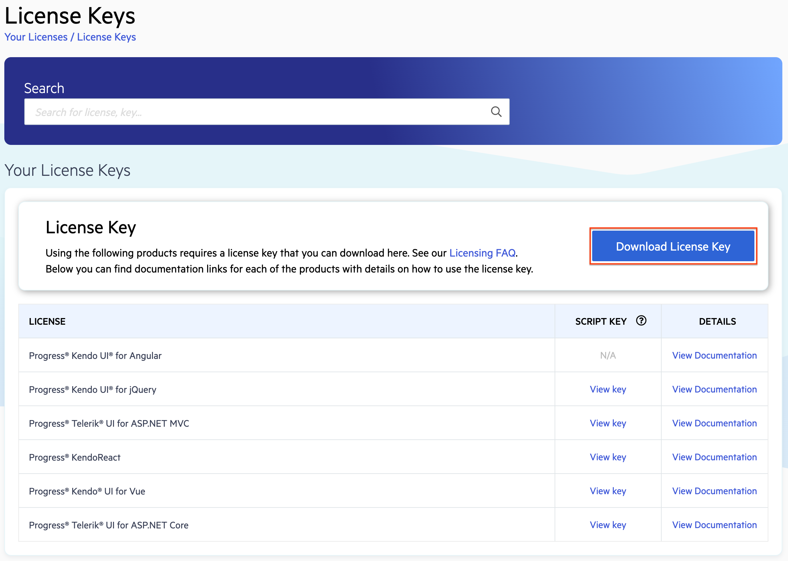

# Set Up Your Kendo UI for Vue License Key

In this article, you’ll learn how to activate the Kendo UI for Vue components by installing a personal license key.

> Since version 3.14.0 (13 September 2023) of Kendo UI for Vue, a missing license causes a watermark to appear over selected components. For more information, see the [Invalid License](slug:license_activation_errors#toc-invalid-license) section below.

Kendo UI for Vue is a professionally developed library distributed under a [commercial license](https://www.telerik.com/purchase/license-agreement/kendo-ui).
Starting from [version 2.0.0](https://www.telerik.com/kendo-vue-ui/components/changelogs/ui-for-vue/), using any of the UI components from the Kendo UI for Vue library requires either a commercial license key or an active trial license key.

The license key installation process involves three steps:

1. Download a license key from this page (see next section).
1. Install or update your license key file in your project.
1. Register the license key by running a CLI command.

## Download Your License Key

To download a license key for Kendo UI for Vue, you must have either a developer license or a trial license. If you are new to Kendo UI for Vue, [sign up for a free trial](https://www.telerik.com/download-trial-file/v2-b/kendo-vue-ui) first and then follow the steps below.

1. Go to the [License Keys](https://www.telerik.com/account/your-licenses/license-keys) page in your Telerik account.

1. Click the **Download License Key** button in the **License Key** banner.

> Starting with the 2025 Q1 release, the name of the downloaded file changes from `kendo-ui-license.txt` to `telerik-license.txt`. This change is required as all Telerik UI and Kendo UI products now use the same licensing mechanism with a common license key. See the [Handling License Key File Name and Environment Variable Name Changes in the 2025 Q1 Release](slug:handling_license_file_name_changes) knowledge base article for more details.

## Installing or Updating the License Key

1. Copy the license key file (`telerik-license.txt`) to the root folder of your application. This is the folder that contains the `package.json` file.
    - Alternatively, copy the contents of the file to the `TELERIK_LICENSE` environment variable.
1. Install `@progress/kendo-licensing` as a project dependency by running `npm install --save @progress/kendo-licensing` or `yarn add @progress/kendo-licensing`.
1. Run `npx kendo-ui-license activate` or `yarn run kendo-ui-license activate` in the console.

> * If both the `TELERIK_LICENSE` environment variable and the `telerik-license.txt` file are present, then the environment variable will be used.

> When renewing your subscription, always regenerate and reactivate the license key. This will allow you to update the Kendo UI for Vue components in your application. Each licensing file contains information about the validity of your subscription and can be used for all Kendo UI for Vue versions published before its expiration date.

## Troubleshooting

If you have a valid license key, and the `License activation failed` warning appears in the terminal, performing a clean, fresh install usually resolves it. To do this, follow these instructions:

1. Run `rm -rf node_modules` to remove all installed packages.
2. Delete the _package-lock.json_ and/or _yarn.lock_ file(s).
3. Make a new npm install and activation of the license.

If the invalid license attributes are still displayed after you have installed or updated the license key, see the [License Activation Errors and Warnings](slug:license_activation_errors) and the [FAQs](slug:faq_license) articles for more information.

## Suggested Links

* [Adding the License Key to CI Services](slug:ci_services_license)
* [License Activation Errors and Warnings](slug:license_activation_errors)
* [Frequently Asked Questions](slug:faq_license)

