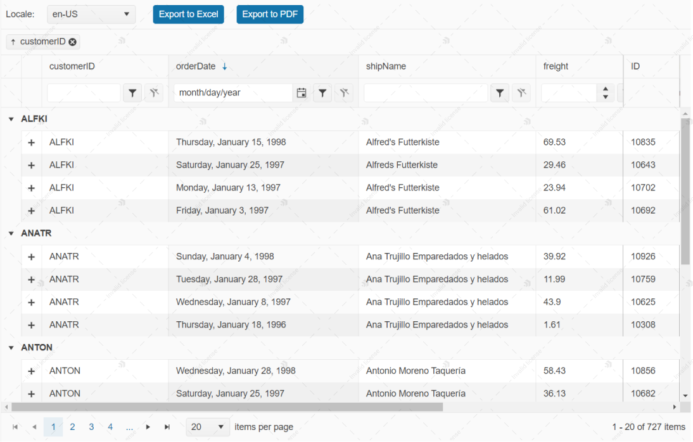
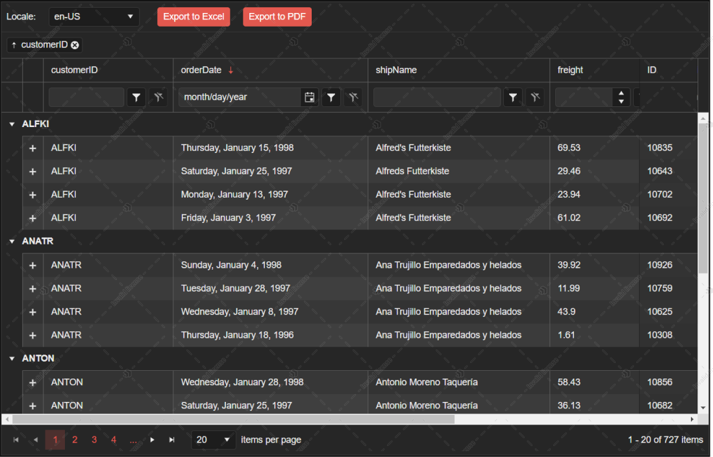
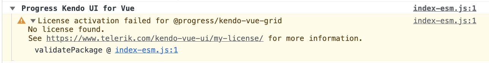

# License Activation Errors and Warnings

Using Kendo UI for Vue without a license or with an invalid license causes specific license warnings and errors. This article defines what an invalid license is, explains what is causing it, and describes the related license warnings and errors.

## Invalid License

An invalid license can be caused by any of the following:

* Using an expired subscription license&mdash;subscription licenses expire at the end of the subscription term.
* Using an expired trial license.
* A missing license for Kendo UI for Vue.
* Not [installing a license key](slug:my_license#installing-or-updating-the-license-key) in your application.
* Not [updating the license key](slug:my_license#installing-or-updating-the-license-key) after renewing your Kendo UI for Vue license.
* Cached old (expired) license key.

## License Warnings

If you use Kendo UI for Vue in a project with an expired or missing license, the UI components exhibit the following invalid license attributes:

* A [watermark](#watermark) appears over a number of selected components.
* A [banner](#banner) is rendered on pages that use the Kendo UI for Vue components.
* A [warning message](#console-warning) is logged in the browser console of pages rendering the Kendo UI for Vue components.

### Watermark

A watermark appearing in the `Light Theme` mode:

  

A watermark appearing in the `Dark Theme` mode:

  

### Banner

A banner appears on pages that use unlicensed Kendo UI for Vue components:

  

* Clicking the **?** button of the banner takes you to the Kendo UI for Vue licensing documentation.
* Clicking the **x** button of the banner closes it until the page is reloaded or a license is activated.

### Console Warning

A warning message similar to the following is logged in the browser's console:

  

## License Activation Errors

If you use Kendo UI for Vue in a project with an expired or missing license, [the `kendo-ui-license activate` command](slug:my_license#installing-or-updating-the-license-key) will indicate the following errors or conditions:

| Error or Condition | Message Code | Solution |
|--------------------|--------------|----------|
| `No license key is detected` | `TKL002` | [Install a license key](slug:my_license) to activate the UI components and remove the error message. |
| `Invalid license key` | `TKL003` | [Download a new license key](slug:my_license#download-your-license-key) and install it to activate the Kendo UI for Vue components and remove the error message. |
| `Your subscription license has expired.` | `TKL103`, `TKL104` | Renew your subscription and [download a new license key](slug:my_license#download-your-license-key). |
| `Your perpetual license is invalid.` | `TKL102` | You are using a product version released outside the validity period of your perpetual license. To remove the error message, do either of the following:  - Renew your license, download a new license key, and install it.  - Downgrade to a product version included in your perpetual license as indicated in the message. |
| `Your trial license has expired.` | `TKL105` | Purchase a commercial license to continue using the product. |
| `Your license is not valid for the detected product(s).` | `TKL101` | Review the purchase options for the listed products. Alternatively, remove the references to the listed packages from `package.json`. |

## See Also

* [Setting Up Your License Key](slug:my_license)
* [Adding the License Key to CI Services](slug:ci_services_license)
* [Frequently Asked Questions](slug:faq_license)
