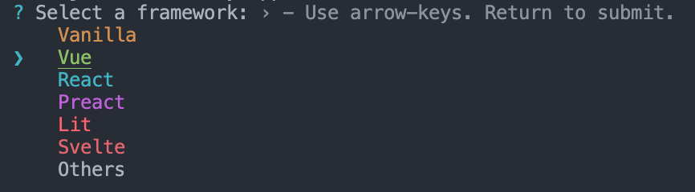
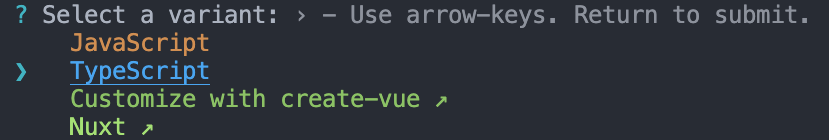

# Get Started with Kendo UI for Vue Native Components with TypeScript and Options API

In this article you’ll learn how to use Kendo UI for Vue Native components in TypeScript context. Below we are building a small app that includes a Grid, a DropDownList, a Window and a design theme.

The current example uses the recommended by Vue [Vite build tool](https://vitejs.dev/) + [Vue Options API](https://vuejs.org/guide/introduction.html#options-api) + Typescript. If you need Getting started information that uses `Vue Composition API` + Typescript, you can check [this link](slug:getting_started_typescript_composition_api).

> Prefer video tutorials? How about a free Telerik UI onboarding course? Check out the [Kendo UI for Vue with TypeScript](https://learn.telerik.com/learn/course/internal/view/elearning/45/kendo-ui-for-vue-with-typescript) training in [Telerik Virtual Classroom](https://learn.telerik.com/learn).

## 1. Set up the Vue project
* The recommended way to start with Vue is to scaffold a project using [Vite](https://vuejs.org/guide/scaling-up/tooling.html#vite). To create a new Vite project use one of the following commands for NPM or Yarn.

Create project commands:

```sh
npm create vite@latest
```
or
```sh
yarn create vite
```

When one of the above commands is executed, the interface will ask you to apply additional configurations to your project:
1. Set the project name: 
Here we can define the name of our new project. For the needs of the current article, set the name of the application as `my-app`

2. Select the framework - Choose `Vue` here:


3. Select the framework variant - Choose `Typescript` to build a Vite project with Vue and Typescript.


When you are ready with the above steps, to run the newly created project do the following commands:
```
  cd my-app
  npm install
  npm run dev
```

## 2. Prepare the Generated Project

> By default, the Vite scaffolding generates a template for Vue project that uses the [Composition API](https://vuejs.org/guide/introduction.html#composition-api) available in the framework. The current article uses [Vue Options API](https://vuejs.org/guide/introduction.html#options-api). A Getting Started Article with Composition API + Typescript can be found on [this link](slug:getting_started_typescript_composition_api). 

Before you start playing with Kendo UI for Vue, let’s clean up the sample app a bit. Here is a list of suggested edits:
* In the `src/components` folder, delete the `HelloWorld.vue` file
* In the src/App.vue file:
	* Remove the import of the HelloWorld component

	```js
	import HelloWorld from './components/HelloWorld.vue'
	```
	* Remove the following code from the template definition:

	```html
  <div>
    <a href="https://vitejs.dev" target="_blank">
      
    </a>
    <a href="https://vuejs.org/" target="_blank">
      
    </a>
  </div>
  <HelloWorld msg="Vite + Vue" />
	```

  * Remove the following CSS styles
  ```css
  .logo {
    height: 6em;
    padding: 1.5em;
    will-change: filter;
  }
  .logo:hover {
    filter: drop-shadow(0 0 2em #646cffaa);
  }
  .logo.vue:hover {
    filter: drop-shadow(0 0 2em #42b883aa);
  }
  ```

  * Clear the `script` tag in the **App.vue** file in a way suitable for the Options API configuration. The `script` tag should look like this:
  ```html-no-run
  <script lang="ts">
  </script>
  ```

Now, when we are ready with the blank Vue project, we can continue the development of our sample application. 

## 3. Add Application Data

Add dummy data needed by the components. Create folder `appdata` in the `src` folder. Add the following files to the `appdata` folder.

* Add a `src/appdata/categories.ts` file and copy the content from [this GitHub file](https://github.com/telerik/kendo-vue/tree/master/getting-started-typescript-options-api/src/appdata/categories.ts).
* Add a `src/appdata/products.ts` file and copy the content from [this GitHub file](https://github.com/telerik/kendo-vue/tree/master/getting-started-typescript-options-api/src/appdata/products.ts).

## 4. Import Kendo UI for Vue components

Kendo UI for Vue is distributed as multiple NPM packages, scoped to `@progress`. For example, the name of the `Grid` package is `@progress/kendo-vue-grid`.

Kendo UI for Vue is a rich suite of many modular components. For our dashboard example, we’ll use three of these components: The Grid, the DropDownList and the Window.

Let’s add the mentioned components’ packages and their dependencies:
```sh
npm install --save @progress/kendo-vue-grid @progress/kendo-data-query @progress/kendo-vue-inputs @progress/kendo-vue-intl @progress/kendo-vue-dropdowns @progress/kendo-vue-dateinputs @progress/kendo-drawing @progress/kendo-vue-data-tools @progress/kendo-vue-animation @progress/kendo-licensing @progress/kendo-svg-icons @progress/kendo-vue-indicators
```
or
```sh
yarn add @progress/kendo-vue-grid @progress/kendo-data-query @progress/kendo-vue-inputs @progress/kendo-vue-intl @progress/kendo-vue-dropdowns @progress/kendo-vue-dateinputs @progress/kendo-drawing @progress/kendo-vue-data-tools @progress/kendo-vue-animation @progress/kendo-licensing @progress/kendo-svg-icons @progress/kendo-vue-indicators
```
With the above, we not only add the packages of the `Grid` and `DropDownList` but also add another important package – `kendo-data-query`. It contains useful functions for client-side data operations.

To install the Window component run the following:
```sh
npm install --save @progress/kendo-vue-dialogs @progress/kendo-licensing @progress/kendo-svg-icons
```
or
```sh
yarn add @progress/kendo-vue-dialogs @progress/kendo-licensing @progress/kendo-svg-icons
```
## 5. Import the Kendo UI for Vue CSS styles

Kendo UI for Vue includes four gorgeous themes, which are all available as separate NPM packages. The available theme packages are [@progress/kendo-theme-default](https://www.npmjs.com/package/@progress/kendo-theme-default), [@progress/kendo-theme-bootstrap](https://www.npmjs.com/package/@progress/kendo-theme-bootstrap), [@progress/kendo-theme-material](https://www.npmjs.com/package/@progress/kendo-theme-material) and [@progress/kendo-theme-fluent](https://www.npmjs.com/package/@progress/kendo-theme-fluent).

Let’s take the Default theme and install it just like we did with the component packages:
```sh
npm install --save @progress/kendo-theme-default
```
or

```sh
yarn add --save @progress/kendo-theme-default
```

Import the CSS files from the package in the `src/App.vue` file. If needed, any additional custom styles can be added in the `<styles>` tag of the `src/App.vue` file.

Here is what we should add:
```js
import '@progress/kendo-theme-default/dist/all.css';
```

## 6. Add a Kendo UI for Vue DropDownList
Now that you have everything set up and ready to go, let’s begin using the Kendo UI for Vue components, starting with the [DropDownList](slug:overview_dropdownlist) component.
Before we continue, the first thing we should do is to import the already installed DropDownList component into the `src/App.vue` file and the `appdata/categories.ts` file using the following code:
```js
import { DropDownList } from '@progress/kendo-vue-dropdowns';
import { categories } from './appdata/categories';
```
Add the DropDownList component with the following code:
```js
export default defineComponent({
  name: 'App',
  components: {
    'dropdownlist': DropDownList,
  },
//..............
```

After importing the component, use the code below to bind a DropDownList to a list of categories.
```html
<dropdownlist
    :data-items="categories"
    :data-item-key="'CategoryID'"
    :text-field="'CategoryName'"
    >
</dropdownlist>
```
The data-items property of the DropDownList points to an array of objects or primitive values. In this case, you’re using an array of objects, and therefore specify both `data-item-key` and `text-field` properties.

You can also use the `default-item` property to display a hint for the users when no item is selected. The default item should have a field that matches the `text-field` name.

To show a little more of the DropDownList in action, update the `src/App.vue` file to use the below code.
```html
<template>
  <div id="app">
    <h1>Hello Kendo UI for Vue!</h1>
    <p>
      <dropdownlist
        :data-items="categories"
        :data-item-key="'CategoryID'"
        :text-field="'CategoryName'"
        :default-item="defaultItems"
        @change="handleDropDownChange"
      ></dropdownlist>&nbsp; Selected category ID:
      <strong>{{ dropdownlistCategory }}</strong>
    </p>
  </div>
</template>

<script lang="ts">
import { defineComponent } from 'vue';
import { categories } from './appdata/categories';
import { DropDownList } from '@progress/kendo-vue-dropdowns';
import '@progress/kendo-theme-default/dist/all.css';

export default defineComponent({
  name: 'App',
  components: {
    'dropdownlist': DropDownList,
  },
  data: function() {
    return {
      categories: categories,
      defaultItems: {CategoryID: null, CategoryName: "Product categories"},
      dropdownlistCategory: null
     }
  },
  methods: {
      handleDropDownChange(e: DropDownListChangeEvent) {
        this.dropdownlistCategory = e.target.value.CategoryID;
      }
  }
}
</script>
```
The above code additionally renders the ID of the selected category next to the `DropDownList`. You do this by defining a `dropdownlistCategory` field in the data options and implementing an [onChange](slug:api_dropdowns_dropdownlistchangeevent) handler to set it.

> In the definition on the `handleDropDownChange` method, you will see the `DropDownListChangeEvent` type defined for the event handler. This type should be defined when we work with TypeScript. The type is exported in the `@progress/kendo-vue-dropdowns` package and to use it we have to update the import definition as follows:
```html
import { DropDownList, DropDownListChangeEvent } from '@progress/kendo-vue-dropdowns';
```

> With the things added above, you can already test the Native DropDownList component. If you need a basic test of the `Kendo UI for Vue Native` suite, you can stop here or continue further with the more complex scenario where the [Grid](slug:overview_grid) and [Window](slug:overview_window) components are used.  

## 7. Add a Kendo UI for Vue Data Grid

Now that you’ve seen what a basic Kendo UI for Vue component looks like, let’s next implement something more complex with the Kendo UI for Vue Data Grid.

The [Kendo UI for Vue Data Grid](slug:overview_grid) provides 100+ ready-to-use features, covering everything from paging, sorting, filtering, editing and grouping, to row and column virtualization and Excel export.
In this section you’ll try out several of these features, but let’s start by seeing a simple Grid in action.

Import the `Grid` component, the `process` package and the products.ts file to the `src/App.vue file`.

```js
import { products } from './appdata/products';
import { process } from '@progress/kendo-data-query';
import { Grid } from '@progress/kendo-vue-grid';
```

Add the code below to create a Grid bound to your list of products. Add it right after the `<p>` that contains the DropDownList in the template inside the `src/App.vue` file.

```html
<grid
  :data-items="products"
  :columns="columns"
></grid>
```

Define the Grid component with the following code:
```js
import { defineComponent } from 'vue';
  name: 'App',
  components: {
    'dropdownlist': DropDownList,
    'grid': Grid,
  },
//..............
```

In the data options add the following lines:

```js
data: function() {
  return {
    categories: categories,
    products: products,
      columns: [
          { field: 'ProductName', title: 'Product Name'},
          { field: 'UnitPrice', title: 'Price' },
          { field: 'UnitsInStock', title: 'Units in Stock' },
          { field: 'Discontinued'}
      ] as GridColumnProps[],
    //..............
  }
}
```

> The above code uses the `GridColumnProps` type. This type should be defined when we work with TypeScript. The type is exported in the `@progress/kendo-vue-grid` package and to use it we have to update the import definition as follows:
```html
import { Grid, GridColumnProps } from '@progress/kendo-vue-grid';
```
More details about the **GridColumnProps** you can find on [its API page](slug:api_grid_gridcolumnprops).

When your browser refreshes, you’ll see your first Grid build with TypeScript! Pretty simple, but not quite real-world yet.

To fill out this example, let’s use the Grid APIs to add the list of features below. Read through the features, and then grab the updated App.vue code (below) to try the updated Grid for yourself.
* Add a height style to the Grid to activate [scrolling](slug:scrollmmodes_grid).
* Add user-friendly [column titles](slug:api_grid_gridcolumnprops#toc-title).
* [Format](slug:api_grid_gridcolumnprops#toc-format) the numbers in the Price column.
* Enable [paging](slug:paging_grid) and [sorting](slug:sorting_grid). This will require a few additions to the application code, explained below.
* Display the boolean values in the Discontinued column as checkboxes. For this purpose, we will [customize the table cell rendering](slug:custom_cells_grid) via the [cell property](slug:api_grid_gridcolumnprops#toc-cell) and a custom component.

Here is how we can implement the above functionality:
* Enable each data operation separately in the Grid declaration ( `:pageable="pageable"` and `:sortable="sortable"`). Add the following properties in the data option.

```js
data: function() {
  return {
      //..............
      pageable: true,
      sortable: true,
      //..............
  }
}
```
* Configure data operation settings and the initial state of the Grid data. For example:
	* The initial [skip](slug:api_grid_gridprops#toc-skip) will be the first one.
	* The page [size (take)](slug:api_grid_gridprops#toc-take) will be 10.
	* The Grid will be [initially sorted](slug:api_grid_gridprops#toc-sort) by Product Name.
	* We will save all these settings in data properties and add them to the Grid using the below code:
```js
data: function() {
  return {
    //..............
    skip: 0 as number | undefined,
    take: 10 as number | undefined,
    sort: [
      { field: "ProductName", dir: "asc" }
    ] as SortDescriptor[] | undefined,
    //..............
  }
}
```
> The above code uses the `SortDescriptor` type. This type should be defined when we work with TypeScript. The type is exported in the `@progress/kendo-data-query` package and to use it we have to update the import definition as follows:
```html
import { SortDescriptor } from '@progress/kendo-data-query';
```
More details about the **SortDescriptor** you can find on [its API page](slug:api_kendo-data-query_sortdescriptor).

* To display the correct Grid data, we will bind the Grid to the output of a function, rather than the `products` array directly. We will use the imported `process` function, which is part of the [kendo-data-query package](https://www.npmjs.com/package/@progress/kendo-data-query). The result of the function will be stored in the `dataResult` data property.
* Define a `dataStateChange` handler. It does two things:
	* Update the state of the `take`, `skip`, `filter` and `sort` data properties after each user interaction via the `createAppState` function.
	* After the data properties are updated, the second thing that the function does is to get a result from the `process` function and set it to the `dataResult` property. This will cause the Grid to refresh and display the expected data. To display the applied data changes, we have to change the `data-items` property of the Grid to `:data-items="dataResult"`.
* Define a template for the Discontinued field of the Grid. Add the following inside the grid tag in the template section of the `src/App.vue` file

```html
<template v-slot:discontinuedTemplate="{ props }">
	<td colspan="1">
		<input type="checkbox" :checked = props.dataItem.Discontinued disabled="disabled" />
	</td>
</template>
```

Edit the columns data property by adding the cell property for the Discontinued cell

```js
columns: [
    { field: 'ProductName', title: 'Product Name' },
    { field: 'UnitPrice', title: 'Price' },
    { field: 'UnitsInStock', title: 'Units in Stock' },
    { field: 'Discontinued', cell: 'discontinuedTemplate' }
] as GridColumnProps[],
```

* Finally, we will add Grid [filtering](slug:filtering_grid) via the DropDownList. To do that, we will use the existing `handleDropDownChang`e function and add a filter descriptor to `gridDataState`. We also need to reset the page index (skip) to zero, as the number of data items and pages will decrease.

To try all discussed above features, copy the below code and paste it in the App.vue file of your project.
```html
<template>
  <div id="app">
    <h1>Hello Kendo UI for Vue!</h1>
    <p>
      <dropdownlist
        :data-items="categories"
        :data-item-key="'CategoryID'"
        :text-field="'CategoryName'"
        :default-item="defaultItems"
        @change="handleDropDownChange"
      ></dropdownlist>&nbsp; Selected category ID:
      <strong>{{ dropdownlistCategory }}</strong>
    </p>

    <grid
      :data-items="dataResult"
      :pageable="pageable"
      :sortable="sortable"
      :sort="sort"
      :take="take"
      :skip="skip"
      :columns="columns"
      @datastatechange="dataStateChange"
      :style="{ height: '400px' }"
    >
      <template v-slot:discontinuedTemplate="{ props }">
        <td :colspan="1">
          <input type="checkbox" :checked="props.dataItem.Discontinued" disabled="disabled" />
        </td>
      </template>
    </grid>
  </div>
</template>

<script lang="ts">
import { defineComponent } from 'vue';
import { products } from './appdata/products';
import { categories } from './appdata/categories';
import { process, DataResult, State, CompositeFilterDescriptor, SortDescriptor } from '@progress/kendo-data-query';
import { Grid, GridDataStateChangeEvent, GridColumnProps } from '@progress/kendo-vue-grid';
import { DropDownList, DropDownListChangeEvent } from '@progress/kendo-vue-dropdowns';
import '@progress/kendo-theme-default/dist/all.css';

export default defineComponent({
  name: 'App',
  components: {
    'dropdownlist': DropDownList,
    'grid': Grid,
  },
  data: function () {
    return {
      categories: categories,
      products: products,
      defaultItems: { CategoryID: null, CategoryName: "Product categories" },
      dropdownlistCategory: null,
      pageable: true,
      sortable: true,
      skip: 0 as number | undefined,
      take: 10 as number | undefined,
      sort: [
        { field: "ProductName", dir: "asc" }
      ] as SortDescriptor[] | undefined,
      filter: {} as CompositeFilterDescriptor,
      columns: [
        { field: 'ProductName', title: 'Product Name' },
        { field: 'UnitPrice', title: 'Price' },
        { field: 'UnitsInStock', title: 'Units in Stock' },
        { field: 'Discontinued', cell: 'discontinuedTemplate' }
      ] as GridColumnProps[],
      dataResult: { data: [] as any, total: 0 } as DataResult,
    }
  },
  created() {
    const dataState: State = {
      skip: this.skip,
      take: this.take,
      sort: this.sort,
    };

    this.dataResult = process(this.products, dataState);
  },
  methods: {
    handleDropDownChange(e: DropDownListChangeEvent) {
      this.dropdownlistCategory = e.target.value.CategoryID;

      if (e.target.value.CategoryID !== null) {
        this.filter = {
          logic: 'and',
          filters: [{ field: 'CategoryID', operator: 'eq', value: e.target.value.CategoryID }]
        }
        this.skip = 0
      } else {
        this.filter = {} as CompositeFilterDescriptor
        this.skip = 0
      }
      let event: GridDataStateChangeEvent = {
        data: {
          skip: this.skip,
          take: this.take,
          sort: this.sort,
          filter: this.filter
        }
      };
      this.dataStateChange(event);
    },
    createAppState: function (dataState: State) {
      this.take = dataState.take;
      this.skip = dataState.skip;
      this.sort = dataState.sort;
    },
    dataStateChange(event: GridDataStateChangeEvent) {
      this.createAppState(event.data);

      if (event.data.filter !== undefined && event.data.filter.logic) {
        this.dataResult = process(products, {
          skip: event.data.skip,
          take: event.data.take,
          sort: event.data.sort,
          filter: event.data.filter
        });
      } else {
        this.dataResult = process(products, {
          skip: event.data.skip,
          take: event.data.take,
          sort: event.data.sort,
        });
      }
    },
  }
});
</script>
```

> Above you will see the usage of the `GridDataStateChangeEvent`, `DataResult`, `State` and `CompositeFilterDescriptor` types. Each of these types is defined in different Kendo UI packages. Here are the import definitions that we need to use the discussed types:
```html
import { process, DataResult, State, CompositeFilterDescriptor, SortDescriptor } from '@progress/kendo-data-query';
import { Grid, GridDataStateChangeEvent, GridColumnProps } from '@progress/kendo-vue-grid';
```
More details about the different types you can find on the [Data Query API page](slug:api_kendo-data-query) and [this GridDataStateChangeEvent API](slug:api_grid_griddatastatechangeevent) documentation.

In this section you were able to add a robust grid to your application—complete with paging, filtering, and sorting. Not a bad accomplishment for a few minutes' worth of work!
Feel free to explore the [Kendo UI for Vue Data Grid documentation page](slug:overview_grid) to get a sense of just how many things the Grid can do.

## 8. Add a Kendo UI for Vue Window
The `products` array contains some fields which are not displayed in the Grid. In this section, you’ll use the Kendo UI for Vue Window to display those additional product details when users select a Grid row.

Here are the required steps.
First import the Window component:

```js
import { Window } from '@progress/kendo-vue-dialogs';

export default {
  name: 'App',
  components: {
    //..............
    'window': Window
  },
  //..............
```

Next, define new `windowVisible` and `gridClickedRow` data properties.
```js
data: function() {
  return {
    //..............
    gridClickedRow:{},
    windowVisible: false
    }
}
```
Next, add a [row click handler](slug:api_grid_gridprops#toc-rowclick) to the Grid.
```html
<grid @rowclick="rowClick">
    //..............
</grid>
```
After that, add the `rowClick` function below, which will set the `windowVisible` flag to true, and assign the data item of the clicked row to the gridClickedRow property. You’ll use the data item values to render the Window's content.
```js
methods: {
    //..............
    rowClick (event){
      this.windowVisible=true;
      this.gridClickedRow=event.dataItem;
    }
    //..............
}
```
Next, add the following Window declaration. (Add it immediately after the Grid's definition in the template.) Notice how the Window will be rendered only if the `windowVisible` flag value is true.
```html
<window v-if="windowVisible" :title="'Product Details'" @close="closeWindow" :height="250">
  <dl style="{textAlign:left}">
    <dt>Product Name</dt>
    <dd>{{gridClickedRow.ProductName}}</dd>
    <dt>Product ID</dt>
    <dd>{{gridClickedRow.ProductID}}</dd>
    <dt>Quantity per Unit</dt>
    <dd>{{gridClickedRow.QuantityPerUnit}}</dd>
  </dl>
</window>
```
Finally, add the following Window [close handler](slug:api_dialogs_windowprops#toc-close), which will set the `windowVisible` flag to false when the user closes the Window.

```js
methods: {
    //..............
    closeWindow (){
      this.windowVisible=false;
    }
}
```
With this code in place, try tapping on a row in the Grid. You should see a custom Window appear with additional product information.

Once again, note how simple this functionality was to implement. With Kendo UI for Vue, you get a collection of Vue components that are easy to drop in and solve hard problems—in this case, building a customizable cross-browser-friendly Window. That’s the power of Kendo UI for Vue!

You can learn more about the `Window component` and what it can do on the [Kendo UI for Vue Window documentation page](slug:overview_window).

## 9. Activate Your Trial or Commercial License
Kendo UI for Vue is a professionally developed library distributed under a [commercial license](https://www.telerik.com/purchase/license-agreement/kendo-ui). Starting from [version 2.0.0](https://www.telerik.com/kendo-vue-ui/components/changelogs/ui-for-vue/), using any of the UI components from the Kendo UI for Vue library requires either a commercial license key or an active trial license key.

Follow the instructions on the Kendo UI for Vue [My License page](slug:my_license_vue) to activate your license.
## 10. Get the Complete Source Code
Your Kendo UI for Vue Getting Started application is complete! You can download and run the complete sample application from the [kendo-vue-examples GitHub repository](https://github.com/telerik/kendo-vue/tree/master/getting-started-typescript-options-api). 

Alternatively, run, fork and [experiment with the application directly in StackBlitz](https://stackblitz.com/edit/vite-jco3ua?file=src%2FApp.vue). 

This article shows just a glimpse of what you can create with Kendo UI for Vue. We hope we’ve managed to get you excited about becoming more a productive Vue developer and building complex UI in a short time through our professional UI library. We’re in it for the long run, so dive in!"

## Additional Resources

The resources in this section will help you get the most out of Kendo UI for Vue.

### ThemeBuilder

To take full control over the appearance of the Kendo UI for Vue components, you can create your own styles by using [ThemeBuilder](slug:themebuilder).

ThemeBuilder is a web application that enables you to create new themes and customize existing ones. Every change that you make is visualized almost instantly. Once you are done styling the Vue components, you can export a zip file with the styles for your theme and use them in your Vue app.

### UI Kits for Figma

Kendo UI for Vue comes with [four UI Kits for Figma](slug:ui_kits_figma): Material, Bootstrap, Fluent, and Kendo UI Default. They provide the designers of your application with a building block that matches the UI components available in the Kendo UI for Vue suite. Having matching building blocks guarantees the smooth implementation of the design.

### Kendo UI for Vue and TypeScript

For more specifics about the usage of the Kendo UI for Vue Native components, you can check the [Kendo UI for Vue TypeScript Integration Overview](slug:overview_typescript_integation) article. 

### VSCode Extension

To help you create projects even faster we have introduced [the Kendo UI VS Code Template Wizard](https://marketplace.visualstudio.com/items?itemName=KendoUI.kendotemplatewizard). To learn more about this awesome extension please check [Introducing the Kendo UI Template Wizard for Visual Studio Code](https://www.telerik.com/blogs/kendo-ui-template-wizard-for-visual-studio-code).
