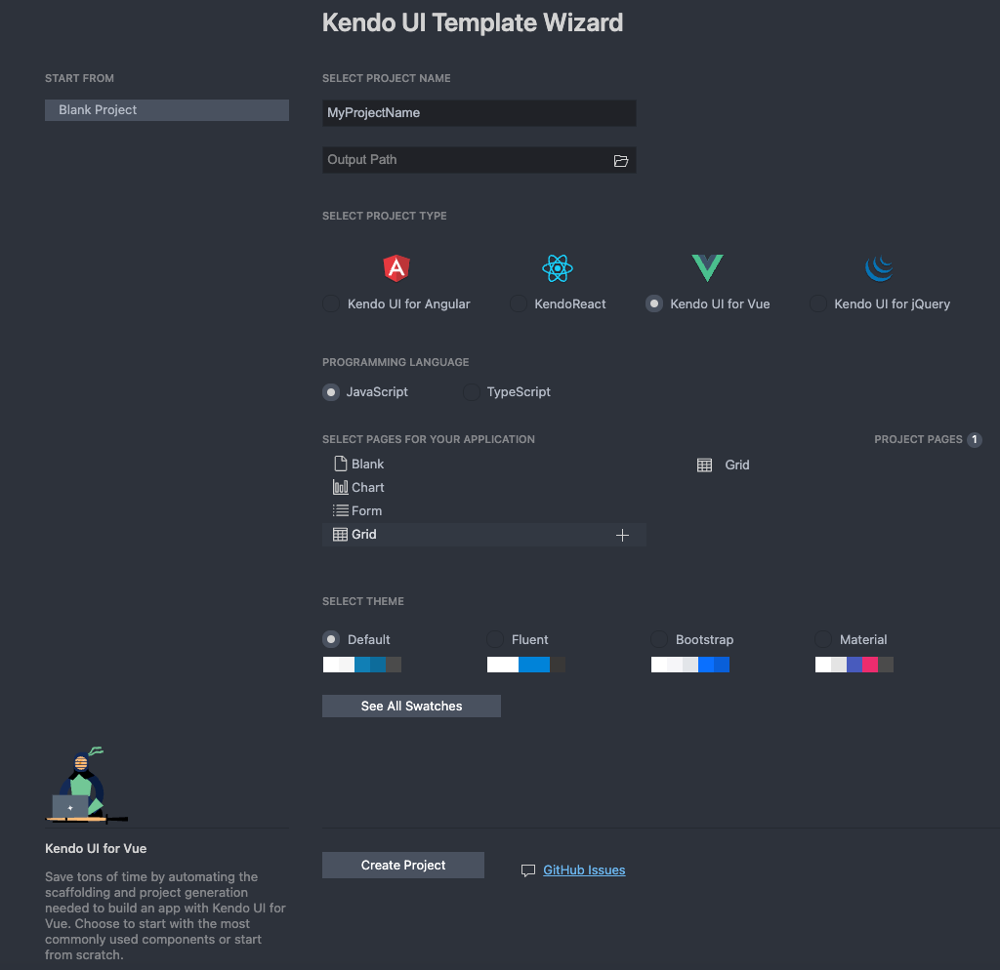
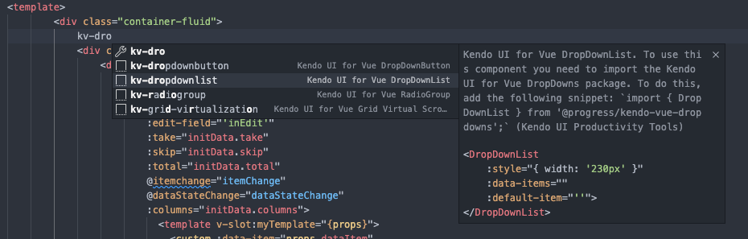

# Using with Kendo UI Productivity Tools

You can easily start a new project with Kendo UI for Vue Native components by using the Kendo UI Productivity Tools Extension for Visual Studio (VS) Code.

## Install VS Code Extensions

You can install the Kendo UI Productivity Tools extension for Visual Studio Code using one of the following options:

* The [Visual Studio Marketplace](https://marketplace.visualstudio.com/items?itemName=KendoUI.kendotemplatewizard).
* The **Extensions** tab in Visual Studio Code:
    1. Search for **Kendo UI Productivity Tools**.
    2. Select the extension from the results list.
    3. Click the **Install** button.


## Create a New Project Using the Grid Template Wizard for VS Code

The Template Wizard provides pre-built templates to easily set up Vue applications by using the Kendo UI for Vue Native components. You can follow the steps below to create a new project with a Grid template:

1. Open the VS Code `Command Palette` (Ctrl + Shift + P for Windows and Command + Shift + P for Mac) and type *Kendo UI Template Wizard* in the command input.
1. In the loaded Template Wizard, set the project name and the path to it.
1. Set the type to *Kendo UI for Vue*
1. In the *Programming Language* button group, select the `JavaScript` option.
1. Add a **Grid** template from the **Select pages for your application** section.
1. In the final step you will have the option to select one of the [supported Kendo UI for Vue themes]() and start your application with it. We will choose `Bootstrap` for our sample project.
1. Click the **Create Project** button button to finish the setup.
  

When you complete the above steps: 
1. Navigate to the newly created project and open it.
1. Install the NPM dependencies by typing `npm install` in the terminal.
1. Run the application by executing `npm run serve` in the terminal.
1. Navigate to <http://localhost:8080/grid> to see the Kendo UI for Vue Grid page.

You can also check the detailed guide for the [Kendo UI Template Wizard for VS Code](https://www.telerik.com/blogs/kendo-ui-template-wizard-for-visual-studio-code).

## Use a Code Snippet to Add a DropDownList to the Project

The Kendo UI Productivity Tools extension for Visual Studio (VS) Code provides a set of code snippets allowing you to add the components directly to the source code of your project.

Following the steps below, we will add a [DropDownList]()component just above the Grid in the already created project:

1. Open the `src/components/Grid.vue` file in the created project and click just after the `<div className="container-fluid">` tag.
1. Type the `kv-` snippet prefix to show the available Kendo UI for Vue snippets
1. Navigate to the `kv-dropdownlist` snippet and press `Enter`
  
1. Make sure that the `DropDownList` component is imported on the page:
   ```jsx
   import { DropDownList } from '@progress/kendo-vue-dropdowns';
   ```
1. Add the DropDownList to the components definitions
    ```jsx
    components: {
        ........
        DropDownList
    }
    ```
1. Use the `data-items` prop to bind the inserted DropDownList to the already defined `initData.gridData` object set its `textField` prop to `ProductName`:
    ```jsx
    <DropDownList :style="{ width: '230px' }" :data-items="initData.gridData" :text-field="'ProductName'"/>
    ```
1. Navigate to <http://localhost:8080/grid> to see the added DropDownList component.

You can see a full list with the code snippets available in the Kendo UI Productivity Tools extension for VS Code [here](#toc-code-snippets-library).

## Generating a Bar Chart by Scaffolding

Utilizing the Scaffolders functionality of the Kendo UI Productivity Tools extension for Visual Studio (VS) Code you can also generate complex Kendo UI for Vue components from an interactive wizard-like user interface.

In this section you will see how to scaffold a Kendo UI for Vue Bar Chart component to an existing Vue project. To do so:

1. Open the created `MyTemplateProject` project in VS Code and right-click on a the `src/components` folder on the project tree.
2. Select the **New Kendo UI for Vue Project Item** option which will open the **Kendo UI for Vue Scaffolding** tab.
3. In the loaded **Item Generator** set the **Project Item Type** to `Chart`, choose a name of the page and select `column` for **Chart Type**.
4. Click the **Create** button to generate the `Column Chart` component.

The result will be similar to:

```jsx
<template>
  <Chart>
    <ChartSeries>
      <ChartSeriesItem
        :type="'column'"
        :data-items="data"
        :name="'Fibonacci'"
      />
    </ChartSeries>
  </Chart>
</template>
<script>
import {
  Chart,
  ChartSeries,
  ChartSeriesItem,
} from '@progress/kendo-vue-charts';
import 'hammerjs';

export default {
  components: {
    Chart,
    ChartSeries,
    ChartSeriesItem,
  },
  data: function () {
    return {
      data: [1, 2, 3, 5, 8, 13],
    };
  },
};
</script>
```

Last but not least, navigate to <http://localhost:8080/chartPage> and see the added Kendo UI for Vue Chart component.

## Activating Your License Key

Using any of the UI components in the Kendo UI for Vue library requires either a commercial license key or an active trial license key.

Follow the instructions on the Kendo UI for Vue [My License page]() to activate your trial or commercial license. You can skip this step if your application already contains a Kendo UI for Vue license file.


## Suggested Links

* [Productivity Tools VS Code Template Project Wizard]()
* [Productivity Tools VS Code for Code Snippets]()
* [Productivity Tools VS Code Scaffolders]()
* [Getting Started with Kendo UI for Vue - JavaScript (Online Guide)](slug:getting_started_javascript_composition_api)
* [Getting Started with Kendo UI for Vue - TypeScript (Online Guide)](slug:getting_started_typescript_composition_api)
* [Getting Started with Kendo UI for Vue - JavaScript + Options API (Online Guide)](slug:getting_started_javascript_options_api)
* [Getting Started with Kendo UI for Vue - TypeScript + Options API (Online Guide)](slug:getting_started_typescript_options_api)
* [Getting Started with Kendo UI for Vue - Nuxt 3 (Online Guide)](slug:getting_started_nuxt_3)