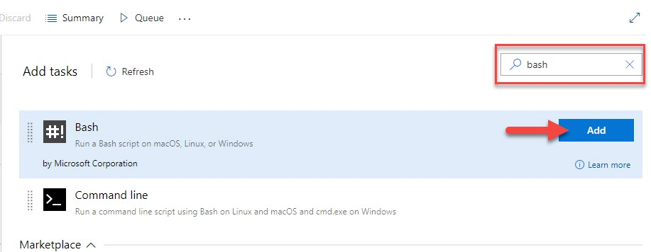
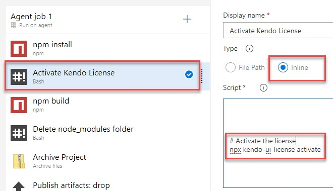
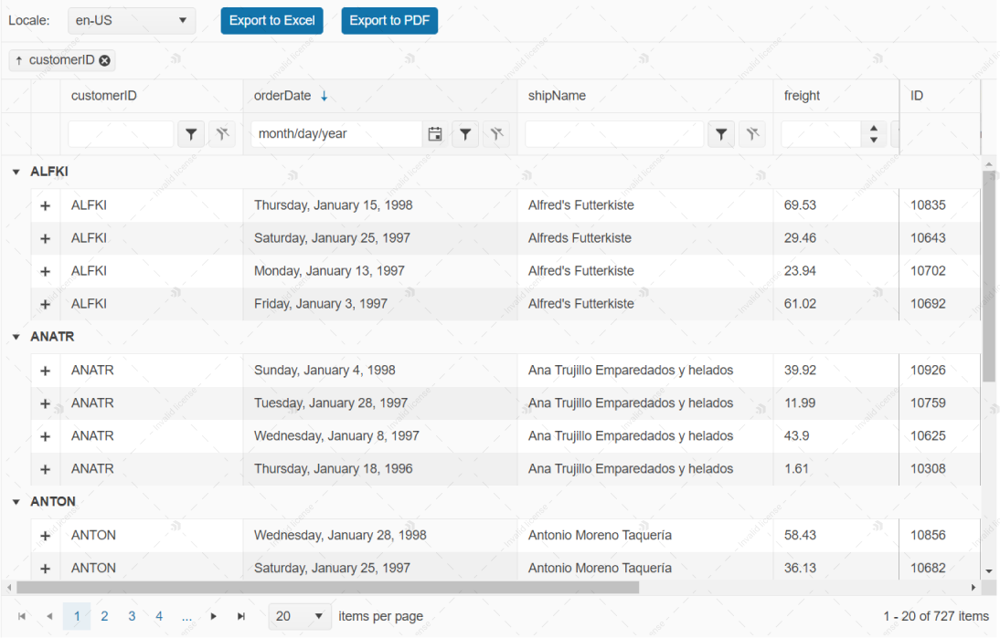
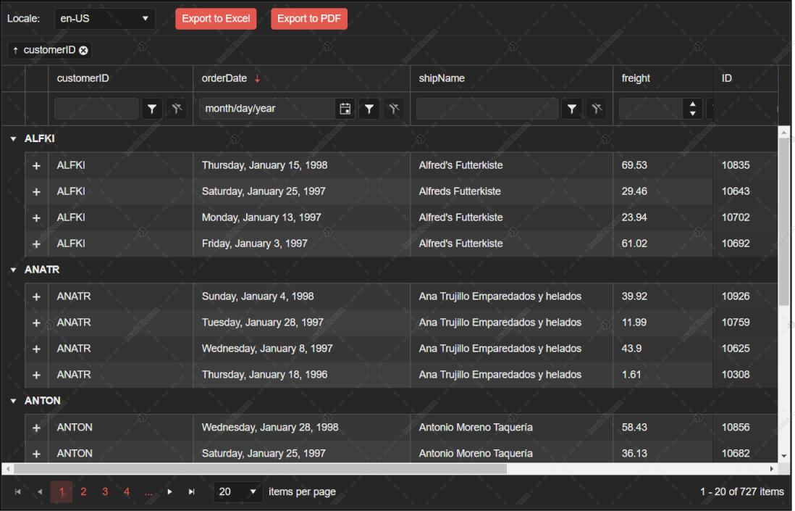
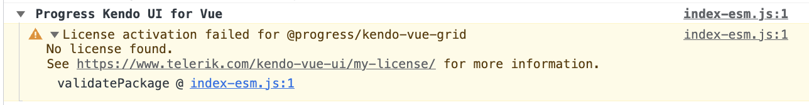

import { Button } from "@progress/bushido/components/buttons";
import LicenseDownload from "gatsby-theme-k3-docs/src/components/license/license-download";
import LicenseScriptKey from "gatsby-theme-k3-docs/src/components/license/license-script-key";

# Set Up Your Kendo UI for Vue License Key

In this article, you’ll learn how to activate the Kendo UI for Vue components by installing a personal license key.

> Since version 3.14.0 (13 September 2023) of Kendo UI for Vue, a missing license causes a watermark to appear over selected components. For more information, see the [Invalid License](#toc-invalid-license) section below. 

Kendo UI for Vue is a professionally developed library distributed under a [commercial license](https://www.telerik.com/purchase/license-agreement/kendo-ui).
Starting from [version 2.0.0](https://www.telerik.com/kendo-vue-ui/components/changelogs/ui-for-vue/), using any of the UI components from the Kendo UI for Vue library requires either a commercial license key or an active trial license key.

To follow the way modern web applications are developed, Kendo UI for Vue serves its packages through npm. While this makes using it in Vue projects seamless, npm hosting does not provide a way for commercial library providers to manage trial and licensed users.

Our community is very important to us and we want to make sure that licensing does not get in your way. Please, let us know if you experience any issues.

**You can send us feedback through the [Contact Us](https://www.telerik.com/contact) form or by opening a [support ticket](https://www.telerik.com/account/support-center).**

The license key installation process involves three steps:
1. Download a license key from this page (see next section).
1. Install or update your license key file in your project.
1. Register the license key by running a CLI command.

> Since May 2022, the **Kendo UI for Vue Wrapper** components also require a license activation. More about the license activation for the Wrapper components, you can find in the [Licensing the Kendo UI for Vue Wrapper components](#toc-licensing-the-kendo-ui-for-vue-wrapper-components) section below.

## Download Your License Key

*This section contains auto-generated content based on the license information for your account.*

<LicenseDownload
  productCodes={['KENDOUIVUE', 'KENDOUICOMPLETE']}
  productName="Kendo UI for Vue"
  purchaseUrl="https://www.telerik.com/purchase/kendo-ui"
  trialUrl="https://www.telerik.com/download-trial-file/v2-b/kendo-vue-ui"
>
    <Button
        as={'a'}
        style={{display: 'inline-flex', textDecoration: 'none'}}
        importance="secondary"
        aria-label="Download link for Kendo UI for Vue license"
        href="/kendo-vue-ui/components/my-license/download"
        target="_blank"
    >
        <svg width="16px" height="16px" viewBox="0 0 512 512">
            <path fill="#fff" d="M32,384L32,384v96h448v-96l0,0H32z M288,32h-64v128h-96l128,160l128-160h-96V32z"/>
        </svg>
        &nbsp;
        kendo-ui-license.txt
  </Button>
</LicenseDownload>

## Managing your License 

You can now easily review, access and download your license keys and license through our improved flow.

1. To view or download your license keys, visit the [License Key Page](https://www.telerik.com/account/your-licenses/license-keys).
2. To view all your licenses, visit the [Your Licenses Page](https://www.telerik.com/account/your-licenses).

## Install or update a License Key

1. Copy the license key file (`kendo-ui-license.txt`) to the root folder of your application. This is the folder that contains the `package.json` file.
    * Alternatively, copy the contents of the file to the `KENDO_UI_LICENSE` environment variable.
1. Install `@progress/kendo-licensing` as a project dependency by running `npm install --save @progress/kendo-licensing` or `yarn add @progress/kendo-licensing`.
1. Run `npx kendo-ui-license activate` or `yarn run kendo-ui-license activate` in the console.

## Add the License Key to CI services

The license key must be present at build time. The recommended approach is to use an environment variable.

Each platform has a different process for setting environment variables. Some popular examples are listed below.

### GitHub Actions

1. Create a new [Repository Secret](https://docs.github.com/en/actions/reference/encrypted-secrets#creating-encrypted-secrets-for-a-repository) or an [Organization Secret](https://docs.github.com/en/actions/reference/encrypted-secrets#creating-encrypted-secrets-for-an-organization). Set the name of the secret to `KENDO_UI_LICENSE` and paste the contents of the license file as value.
1. Add a build step to activate the license _after_ running `npm install` or `yarn`:

```yaml
steps:
    # ... install modules before activating the license
    - name: Install NPM modules
      run: npm install

    - name: Activate Kendo UI License
      run: npx kendo-ui-license activate
      # Set working directory if the application is not in the repository root folder:
      # working-directory: 'ClientApp'
      env:
        KENDO_UI_LICENSE: ${{ secrets.KENDO_UI_LICENSE }}

    # ... run application build after license activation
    - name: Build Application
      run: npm run build
```

### Azure Pipelines (YAML)

1. Create a new [User-defined Variable](https://docs.microsoft.com/en-us/azure/devops/pipelines/process/variables?view=azure-devops&tabs=yaml%2Cbatch) named `KENDO_UI_LICENSE`. Paste the contents of the license key file as value.
1. Add a build step to activate the license _after_ running `npm install` or `yarn`:

Syntax for Windows build agents:

```yaml
pool:
  vmImage: 'windows-latest'

steps:

# ... install modules before activating the license
- script: call npm install
  displayName: 'Install NPM modules'

- script: call npx kendo-ui-license activate
  displayName: 'Activate Kendo UI License'
  # Set working directory if the application is not in the repository root folder:
  # workingDirectory: 'ClientApp'
  env:
    KENDO_UI_LICENSE: $(KENDO_UI_LICENSE)

# ... run application build after license activation
- script: call npm run build
  displayName: 'Build Application'
```

Syntax for Linux build agents:

```yaml
pool:
  vmImage: 'ubuntu-latest'

steps:

# ... install modules before activating the license
- script: npm install
  displayName: 'Install NPM modules'

- script: npx kendo-ui-license activate
  displayName: 'Activate Kendo UI License'
  # Set working directory if the application is not in the repository root folder:
  # workingDirectory: 'ClientApp'
  env:
    KENDO_UI_LICENSE: $(KENDO_UI_LICENSE)

# ... run application build after license activation
- script: npm run build
  displayName: 'Build Application'
```

### Azure Pipelines (Classic)

1. Create a new [User-defined Variable](https://docs.microsoft.com/en-us/azure/devops/pipelines/process/variables?view=azure-devops&tabs=classic%2Cbatch) named `KENDO_UI_LICENSE`. Paste the contents of the license key file as value.
2. Add a new Bash task to the Agent job (before the npm build task)



3. Change the step to inline and use the following command

```bash
# Activate the license
npx kendo-ui-license activate
```



## Set License Key when using CDN scripts

To activate the license when using CDN scripts, perform the following steps:

1. Load the common kendo-licensing script _before_ the component scripts.

    ```html
    <script src="https://unpkg.com/@progress/kendo-licensing/dist/index.js"></script>
    ```

1. Add your Script License key.

  *This section contains auto-generated content based on the license information for your account.*
<LicenseDownload
  productCodes={['KENDOUIVUE', 'KENDOUICOMPLETE']}
  productName="Kendo UI for Vue"
  purchaseUrl="https://www.telerik.com/purchase/kendo-ui"
  trialUrl="https://www.telerik.com/download-trial-file/v2-b/kendo-vue-ui">
  <LicenseScriptKey url="https://www.telerik.com/kendo-vue-ui/components/my-license/download" />
</LicenseDownload>

 1. Add the rest of the scripts from the "Using CDN" section in the components Overview page.

## Licensing the Kendo UI for Vue Wrapper components

When working with the Kendo UI for Vue suite, we recommend the usage of our `Native` components versus their `Wrapper` equivalents. However, there are a few components that are still not available as native ones. This requires the use of the Wrapper components in specific scenarios.

Since the May 2022 release, if you use the Kendo UI for Vue Wrapper components, you need to make a second license activation for the `@progress/kendo-ui` package. This package is used by the Wrapper components and should be licensed separately. 

To activate the license of the `@progress/kendo-ui` package, you can follow the instructions from the Kendo UI for jQuery documentation available on [this link](https://docs.telerik.com/kendo-ui/intro/installation/using-license-code).

>The above instructions should be followed `only` when you are using the `Kendo UI for Vue Wrapper` components. If you are using the Kendo UI for Vue Native components, you should skip the current section of this article. 

## Invalid License

An invalid license can be caused by any of the following:

* Using an invalid or expired commercial license.
* Using an expired trial license.
* Not [installing or updating the Kendo UI for Vue license key](#toc-install-or-update-a-license-key) in your application.

If you use Kendo UI for Vue in a project with an expired or missing license, the UI components will exhibit the following behavior:
1. A watermark appears over a number of selected components:
    * A watermark appearing in the `Light Theme` mode.
    
    * A watermark appearing in the `Dark Theme` mode.
    
1. A banner appears on pages that use unlicensed Kendo UI for Vue components.

    * Clicking the **?** button of the banner takes you to the Kendo UI for Vue licensing documentation.
    * Clicking the **x** button of the banner closes the banner until the page is reloaded or a license is activated. 
1. A warning message similar to the following is logged in the browser's console 
  

## Frequently Asked Questions

### Will the product function without a license key?

Yes, the product will continue to function normally without a license key. However, the following will happen if a valid license key is not present: 
* A watermark will appear above selected Kendo UI for Vue components.
* A licensing banner will pop over a page that uses unlicensed Kendo UI for Vue components.
* A warning message will appear in the browser console.

See the [Invalid License](#toc-invalid-license) section for more information.

Please, be aware that future updates of the library may restrict or disable some features when no valid license is present.

### Will a watermark and license banner appear if I use a Kendo UI for Vue version that was released prior to v.3.14.0?

If you have a valid license activated for your project, you won't get any [invalid license attributes](#toc-invalid-license). 

### Does the license key expire?

Yes, the license key expires at the end of your support subscription.

For trial users, this is at the end of your 30-day trial. For licensed developers, this is when your subscription expires.

You will need to obtain and install a new license key after starting a trial, renewing a license, or upgrading a license.

An expired license key is valid for all Kendo UI for Vue versions _published before its expiration date_. The publish date of each version is available in the [Kendo UI for Vue changelog](https://www.telerik.com/kendo-vue-ui/components/changelogs/ui-for-vue/).

### I am using Vite in my project. I can't hide the invalid license watermarks, banner, and console warning even though the license activation is successful. What should I do? 

The described scenario happens in Vite context and most often when you have previously activated a commercial or trial license in your project and now you want to renew this license. In the discussed case, once you run `npx kendo-ui-license activate`, the console message says you have successfully activated your license but in fact, all [invalid license attributes](#toc-invalid-license) are still presented. 

The reason for the issue is that Vite is not updating its cache after the licensing command is executed. To make the warning disappear:
1. Delete the `.vite` folder in the `node_modules` folder of the project.
1. Execute the `npx kendo-ui-license activate` command. 

### I updated the version of the Kendo UI for Vue packages in my project and the invalid license attributes appeared. How to hide these items?

If this happens, the possible reason is that the end date of the license activated in your application is before the release date of the newly installed Kendo UI for Vue packages. To fix this issue:
1. [Download a new license key](#toc-download-your-license-key).
1. [Activate the new license key](#toc-install-or-update-a-license-key) in your project. 

### Do I need an Internet connection to activate the license?

No, the license activation and validation are performed entirely offline.

No network requests are made at any point of the project lifecycle.

### Should I add the license key to source control?

No, the license key file (kendo-ui-license.txt) or its contents should not be added to source control.

Build servers should use the `KENDO_UI_LICENSE` environment variable as described above.

**DO NOT** Store the license key in plaintext, for example in a GitHub Actions Workflow definition.

### Is it possible to activate the license without executing commands?

Yes, the license will be activated automatically if it is present during package installation. This applies to both license key files and the environment variable. A diagnostic message will be printed in the `npm install` log.

Using the `kendo-ui-license activate` command is optional, but recommended in builds as it will return an error if the activation fails.

### What happens if both the environment variable and the license key file are present?

If both the `KENDO_UI_LICENSE` environment variable and the `kendo-ui-license.txt` file are present, then the environment variable is used.

To enforce the use of the license key file, unset the environment variable.

### My team has more than one licensed developer. Which key should we use?

Any of the keys associated with your subscription(s) could be used to activate Kendo UI for Vue.

### Are older versions of Kendo UI for Vue affected?

No, versions prior to v2.0.0 do not require a license key.
