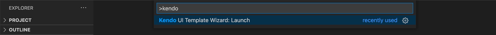

# Kendo UI Productivity Tools VS Code Extension

The Kendo UI Productivity Tools extension for Visual Studio Code enhances the experience of developing web applications with Kendo UI for Vue components. 

The extension facilitates new projects creation by providing a powerful template wizard. It also allows you to add Kendo UI for Vue components to an existing project with just a few clicks. This could be achieved directly in the source code through snippets or via a scaffolder configuration wizard, which automatically handles the code generation process.

## Installation

You can install the Kendo UI Productivity Tools extension for Visual Studio Code through:

* The [Visual Studio Marketplace](https://marketplace.visualstudio.com/items?itemName=KendoUI.kendotemplatewizard)

* The `Extensions tab` in Visual Studio Code:
    * Search for `Kendo UI Productivity Tools`
    * Select the extension from the results list
    * Click on the `Install` button

## Key Features

The Kendo UI Productivity Tools provides a number of handy and developer-friendly tools that facilitate the project creation and integration of the Kendo UI for Vue components. Our team constantly invests efforts to further enhance the existing functionalities as well as to develop new features. 

The Kendo UI Productivity Tools extension delivers the following features:

### Project Wizard

The Kendo UI Productivity Tools extension eases development efforts by providing аn interface for creating new projects that are pre-configured for Kendo UI for Vue components. The Template Wizard provides a blank project template, which could be further enhanced by adding more pages with Grids, Charts, Forms etc. You can easily configure the desired theme for your application by choosing from Default, Bootstrap or Material. The end result is a ready-to-run application with all required configurations and dependencies. More information can be found [`here`](slug:vue_vscode_project_wizard).

### Code Snippets

The extension provides rich support for Kendo UI for Vue component snippets. The library consists of components such as Grid, Inputs, Layouts, Chart etc. They facilitate the development process by providing a quick way for adding Kendo UI for Vue components with predefined tab stops for additional properties configuration. More information can be found [`here`](slug:vue_vscode_snippets).

## Suggested Links

* [Download the Kendo UI Productivity Tools Extension](https://marketplace.visualstudio.com/items?itemName=KendoUI.kendotemplatewizard)
* [Project Wizard](slug:vue_vscode_project_wizard)
* [Code Snippets](slug:vue_vscode_snippets)
