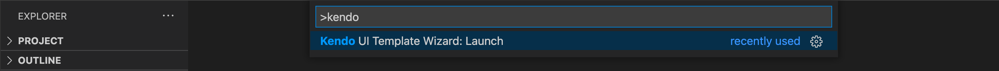
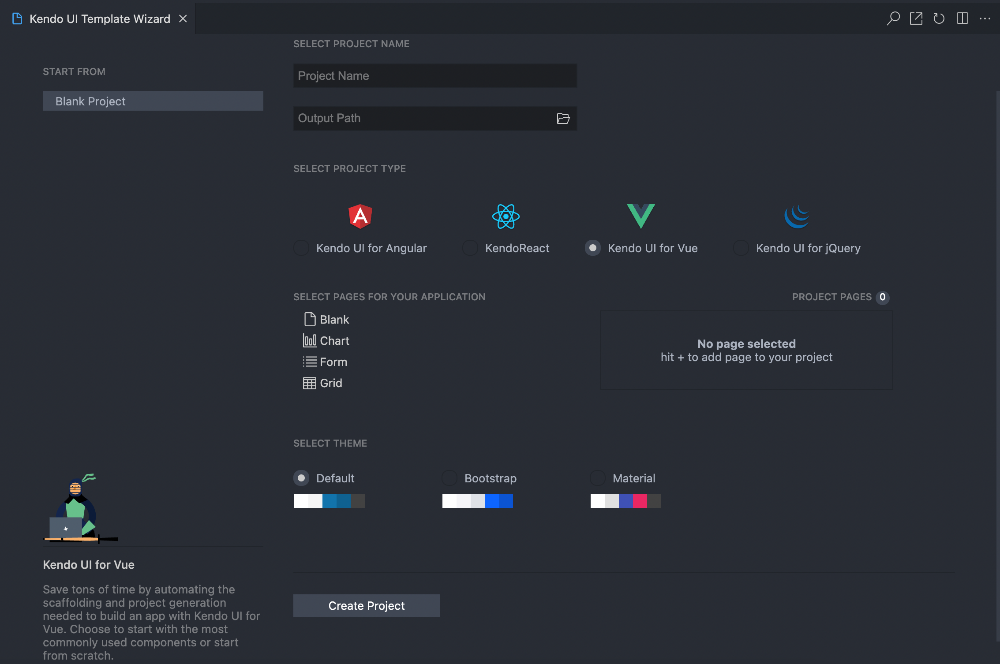

# Vue Project Wizard

This article demonstrates how to use the Kendo UI Productivity Tools extension for Visual Studio Code to create new projects that are pre-configured for the Kendo UI for Vue components.

## Project Creation

To create a new Kendo UI for Vue project:

* Press `Ctrl`+`Shift`+`P` in Windows/Linux or `Cmd`+`Shift`+`P` on Mac to open the VS Code extension launcher

* Type/Select `Kendo UI Productivity Tools: Launch` and press `Enter` to launch the extension

## Project Configuration

1. Choose a name for your project and an output directory
1. Pick `Kendo UI for Vue` from the listed Kendo UI suites
1. Select the pages that should be included in the new project. The currently available options are `Blank`, `Grid`, `Chart` and `Form`
1. Select the Kendo UI theme to be applied. You can choose between `Default`, `Bootstrap` and `Material` themes
1. Finally, click on `Create` to generate the new project

## Suggested Links

* [Download the Kendo UI Productivity Tools Extension](https://marketplace.visualstudio.com/items?itemName=KendoUI.kendotemplatewizard)
* [Overview](slug:vue_vscode_overview)
* [Code Snippets](slug:vue_vscode_snippets)
