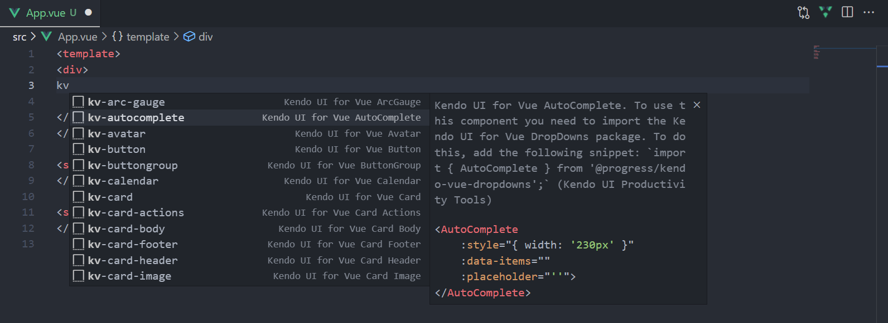

# Vue Code Snippets

The Kendo UI Productivity Tools extension provides a handy feature for improving the daily development with our library – code snippets for fast UI component reference and configuration. Snippets simplify and accelerate the implementation of Kendo UI components in your project. They facilitate the development process by providing a quick way for adding the components directly in the source-code, while also including predefined tab stops for the required options.

> Our snippets library covers all our components. You can easily add a Grid, Inputs, Layouts, Scheduler, Buttons, etc. just with a single snippet.

To take advantage of the tens availbale code snippets, follow the steps below:

1. Make sure you have the [Volar extension](https://marketplace.visualstudio.com/items?itemName=Vue.volar) installed.
1. Click inside the template section of the component, where the Kendo UI for Vue Native component should be inserted.
1. Type the `kv-` snippet prefix to list the `Kendo UI for Vue` snippets
1. Continue by typing the name of the component that should be inserted. Some components are provided by multiple snippets, which allow you to create them in multiple ways, depending on the desired configuration

1. Press `Enter` to insert the desired component in the source-code
1. Optionally, if the component provides placeholders for specific properties, you could iterate and provide them by pressing the `Tab` key
1. Import the component whose snippet is inserted. Details about the package you need to import can be found in the description popup of the inserted snippet. For example:
    ```js
    import { AutoComplete } from '@progress/kendo-vue-dropdowns';

    ```
1. If using the `Options API`, add the component name in the [components](https://vuejs.org/api/options-misc.html#components) section. For example:
    ```js
    components: {
        AutoComplete
    }
    ```

## Code Snippets Library

|COMPONENT                    | SNIPPETS|
|:---                         |:---   |
|**Buttons**|
|Button                         |kv-button|
|ButtonGroup                    |kv-buttongroup|
|Chip                           |kv-chip|
|ChipList                       |kv-chiplist|
|DropDownButton                 |kv-dropdownbutton|
|FloatingActionButton           |kv-floatingactionbutton|
|Toolbar                        |kv-toolbar|
|SplitButton                    |kv-splitbutton|
|**Charts**|
|Area Chart                     |kv-area-chart|
|Bar Chart                      |kv-bar-chart|
|Box Plot                       |kv-box-plot-chart|
|Bubble                         |kv-bubble-chart|
|Bullet                         |kv-bullet-chart|
|Donut                          |kv-donut-chart|
|Funnel                         |kv-funnel-chart|
|Line                           |kv-line-chart|
|Pie                            |kv-pie-chart|
|Polar                          |kv-polar-chart|
|Radar                          |kv-radar-chart|
|Range Area                     |kv-range-area-chart|
|Range Bar                      |kv-range-bar-chart|
|Scatter                        |kv-scatter-chart|
|Sparkline                      |kv-sparkline-chart|
|Stock Chart                    |kv-stock-chart|
|Waterfall Chart                |kv-waterfall-chart|
|**Data Tools**|
|Filter                         |kv-filter|
|Pager                          |kv-pager|
|**DateInputs**|
|Calendar                       |kv-calendar|
|DateInput                      |kv-dateinput|
|DatePicker                     |kv-datepicker|
|DateTimePicker                 |kv-datetimepicker|
|DateRangePicker                |kv-daterangepicker|
|MultiViewCalendar              |kv-multiviewcalendar|
|TimePicker                     |kv-timepicker|
|**Dialogs**|
|Dialog                         |kv-dialog|
|Dialog Action Bar              |kv-dialog-actions-bar|
|Window                         |kv-window|
|**Dropdowns**|
|AutoComplete                   |kv-autocomplete|
|ComboBox                       |kv-combobox|
|DropDownList                   |kv-dropdownlist|
|MultiSelect                    |kv-multiselect|
|**Editor**|
|Editor                         |kv-editor|
|**Form**|
|Form                           |kv-form|
|Form Field                     |kv-form-field|
|Form Element                   |kv-form-element|
|**Gauges**|
|ArcGauge                       |kv-arc|
|CircularGauge                  |kv-circular|
|LinearGauge                    |kv-linear|
|RadialGauge                    |kv-radial|
|**Grid**|
|Grid                           |kv-grid|
|Grid Virtual Scrolling         |kv-grid-virtualization|
|**Indicators**|
|Loader                         |kv-loader|
|Skeleton                       |kv-skeleton|
|**Inputs**|
|Checkbox                       |kv-checkbox|
|Input                          |kv-input|
|MaskedTextBox                  |kv-maskedtextbox|
|NumericTextBox                 |kv-numerictextbox|
|RadioButton                    |kv-radiobutton|
|RadioGroup                     |kv-radiogroup|
|Slider                         |kv-slider|
|RangeSlider                    |kv-rangeslider|
|Slider Label                   |kv-slider-label|
|Switch                         |kv-switch|
|TextArea                       |kv-textarea|
|**Labels**|
|FloatingLabel                  |kv-floatinglabel|
|Label                          |kv-label|
|Hint                           |kv-hint|
|Error                          |kv-error|
|**Layout**|
|Avatar                         |kv-avatar|
|Card                           |kv-card|
|Card Header                    |kv-card-header|
|Card Title                     |kv-card-title|
|Card Subtitle                  |kv-card-subtitle|
|Card Body                      |kv-card-body|
|Card Actions                   |kv-card-actions|
|Card Footer                    |kv-card-footer|
|Card Image                     |kv-card-image|
|Drawer                         |kv-drawer|
|Menu                           |kv-menu|
|ContextMenu                    |kv-contextmenu|
|PanelBar                       |kv-panelbar|
|Splitter                       |kv-splitter|
|Stepper                        |kv-stepper|
|TabStrip                       |kv-tabstrip|
|Wizard                         |kv-wizard|
|**Notification**|
|Notification                   |kv-notification|
|Notification Group             |kv-notification-group|
|**Popup**|
|Popup                          |kv-popup|
|**Progress Bars**|
|ProgressBar                    |kv-progressbar|
|**Scheduler**|
|Scheduler                      |kv-scheduler|
|**ScrollView**|
|ScrollView                     |kv-scrollview|
|**Tooltip**|
|Tooltip                        |kv-tooltip|
|**TreeView**|
|TreeView                       |kv-treeview|
|**Upload**|
|Upload                         |kv-upload|

## Suggested Links

* [Download the Kendo UI Productivity Tools Extension](https://marketplace.visualstudio.com/items?itemName=KendoUI.kendotemplatewizard)
* [Overview](slug:vue_vscode_overview)
* [Project Wizard](slug:vue_vscode_project_wizard)
